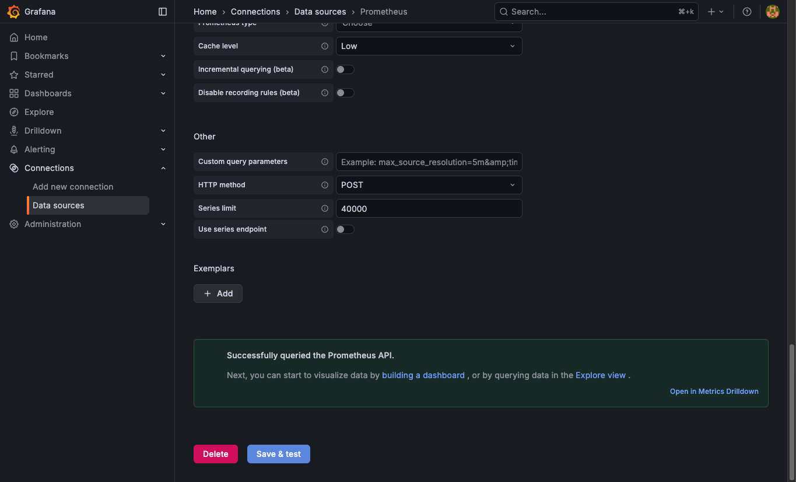
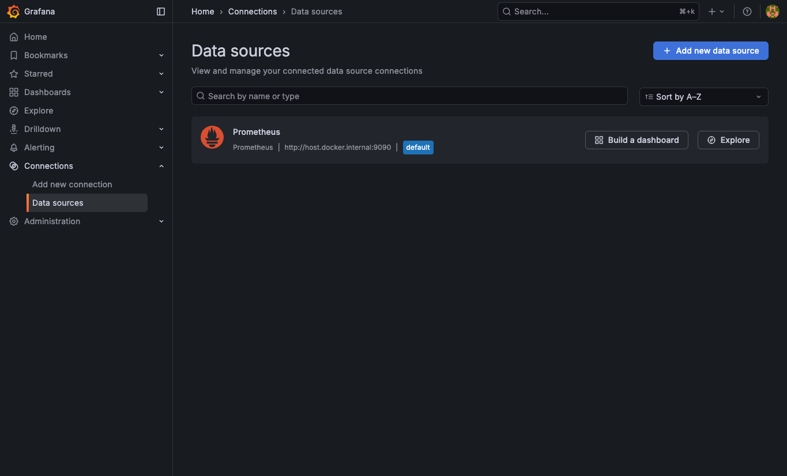

# Reto 5 — Uso de Docker y Grafana
## Diplomado en Automatización de Pruebas
### Alumna: Adriana Troche Robles
### Fecha: 19 de febrero de 2026

---

## Objetivo

Construir un flujo minimalista que demuestre un sistema observable para métricas de calidad de pruebas (**flake rate** y **defect leakage**), usando **Grafana** para visualización, **Prometheus** como intermediario de scraping y **Docker** para despliegue.

Este ejercicio refuerza el principio clave del Tema 6: *"medir antes de automatizar"*, priorizando la observabilidad sobre la sofisticación tecnológica.

---

## Arquitectura del Stack

```
┌────────────────┐        ┌────────────┐        ┌────────────┐
│ test-metrics   │ scrape │ Prometheus │  data  │  Grafana   │
│ (Python HTTP)  │◄───────│  :9090     │◄───────│  :3001     │
│ :8080          │ /15s   │            │ source │            │
│                │        │ Almacena   │        │ Dashboard: │
│ flake_rate     │        │ series     │        │ Flake Rate │
│   = 0.08      │        │ temporales │        │ Defect     │
│ defect_leakage │        │            │        │ Leakage    │
│   = 0.03      │        │            │        │            │
└────────────────┘        └────────────┘        └────────────┘
```

**Contenedores Docker desplegados:**
- `test-metrics` — Servidor Python que expone métricas en formato Prometheus
- `prometheus` — Scraping y almacenamiento de métricas
- `grafana` — Visualización mediante dashboard

---

## Paso 1: Desplegar contenedor de métricas

### Comando ejecutado:

```bash
docker run -d -p 8080:8080 --name test-metrics python:3.11-slim \
  python3 -c '
from http.server import HTTPServer, BaseHTTPRequestHandler

METRICS = """# HELP flake_rate Percentage of flaky tests
# TYPE flake_rate gauge
flake_rate 0.08
# HELP defect_leakage Defects escaping to production
# TYPE defect_leakage gauge
defect_leakage 0.03
"""

class Handler(BaseHTTPRequestHandler):
    def do_GET(self):
        self.send_response(200)
        self.send_header("Content-Type", "text/plain; charset=utf-8")
        self.end_headers()
        self.wfile.write(METRICS.encode())
    def log_message(self, *a): pass

HTTPServer(("0.0.0.0", 8080), Handler).serve_forever()
'
```

### Explicación:

Se crea un mini servidor HTTP en Python que expone dos métricas de calidad de pruebas en formato Prometheus:

- **`flake_rate 0.08`** — Tasa de pruebas inestables (8%), simulando lo que reportaría un pipeline CI/CD real
- **`defect_leakage 0.03`** — Defectos que escapan a producción (3%), métrica clave de gobernanza de calidad

El servidor responde en cualquier ruta con `Content-Type: text/plain`, que es el formato requerido por Prometheus para el scraping.

### Evidencia 1 — Endpoint de métricas funcionando:


**Verificación:** `http://localhost:8080/metrics` muestra las métricas en formato Prometheus válido.

---

## Paso 2: Desplegar Prometheus como intermediario

### Configuración (`prometheus.yml`):

```yaml
global:
  scrape_interval: 15s

scrape_configs:
  - job_name: 'test-metrics'
    static_configs:
      - targets: ['host.docker.internal:8080']
```

### Comando ejecutado:

```bash
docker run -d -p 9090:9090 --name prometheus \
  -v ~/reto5/prometheus.yml:/etc/prometheus/prometheus.yml \
  prom/prometheus
```

### Explicación:

Prometheus actúa como intermediario obligatorio entre el endpoint de métricas y Grafana. Cada 15 segundos hace *scraping* del endpoint `http://host.docker.internal:8080/metrics`, almacena los valores como series temporales y los expone vía API PromQL para que Grafana pueda consultarlos.

Se usa `host.docker.internal` que es la forma estándar de referenciar el host desde dentro de un contenedor en Docker Desktop para macOS.

### Evidencia 2 — Prometheus scrapeando métricas (target UP):


**Verificación:** `http://localhost:9090/targets` muestra el target `test-metrics` con estado **UP** y scrape exitoso.

---

## Paso 3: Desplegar Grafana y visualizar métricas

### Comando ejecutado:

```bash
docker run -d -p 3001:3000 --name grafana \
  -e GF_SECURITY_ADMIN_USER=admin \
  -e GF_SECURITY_ADMIN_PASSWORD=admin \
  grafana/grafana-oss
```

> **Nota:** Se usó el puerto 3001 en lugar de 3000 porque el puerto 3000 estaba ocupado por otro proceso en la máquina local.

### Configuración del Data Source:

Se configuró Prometheus como fuente de datos en Grafana:
- **Tipo:** Prometheus
- **URL:** `http://host.docker.internal:9090`
- **Acceso:** Server (proxy)

### Evidencia 3 — Data Source configurado exitosamente:



**Verificación:** El mensaje **"Successfully queried the Prometheus API"** confirma la conexión entre Grafana y Prometheus.

### Creación del Dashboard:

Se creó el dashboard **"QA Metrics Dashboard"** con dos paneles tipo **Stat**:

| Panel | Query PromQL | Valor | Significado |
|-------|-------------|-------|-------------|
| **Flake Rate** | `flake_rate` | 8% | Porcentaje de pruebas inestables |
| **Defect Leakage** | `defect_leakage` | 3% | Defectos que escapan a producción |

Ambos paneles usan umbrales de color para indicar el nivel de riesgo:
- Verde: valores aceptables
- Amarillo: precaución
- Rojo: requiere acción

### Evidencia 4 — Dashboard QA Metrics:


**Verificación:** El dashboard muestra correctamente ambas métricas de calidad de pruebas.

---

## Verificación Final — Los 3 contenedores activos

### Salida de `docker ps`:

```
NAMES          STATUS          PORTS
grafana        Up 7 minutes    0.0.0.0:3001->3000/tcp
test-metrics   Up 9 minutes    0.0.0.0:8080->8080/tcp
prometheus     Up 10 minutes   0.0.0.0:9090->9090/tcp
```

### Evidencia 5 — Lista de Data Sources en Grafana:



---

## Resumen de Evidencias

| # | Evidencia | Archivo |
|---|-----------|---------|
| 1 | Endpoint `/metrics` con flake_rate y defect_leakage | `02_metrics_endpoint.png` |
| 2 | Prometheus target UP | `03_prometheus_targets.png` |
| 3 | Data Source con "Successfully queried the Prometheus API" | `04_datasource_success.png` |
| 4 | Dashboard QA Metrics con paneles Stat | `05_dashboard_qa_metrics.png` |
| 5 | Data Sources de Grafana | `04a_datasource_list.png` |

---

## Conclusión

Se implementó exitosamente un stack de observabilidad minimalista con tres contenedores Docker que demuestra el flujo completo de métricas de calidad de pruebas:

1. **Exposición de métricas** — Un servidor Python simula lo que haría un pipeline CI/CD real, exponiendo `flake_rate` y `defect_leakage` en formato Prometheus
2. **Recolección** — Prometheus hace scraping cada 15 segundos y almacena las series temporales
3. **Visualización** — Grafana presenta las métricas en un dashboard intuitivo con paneles tipo Stat

Este ejercicio demuestra el principio *"medir antes de automatizar"*: antes de implementar soluciones complejas de automatización, es fundamental tener visibilidad sobre las métricas de calidad que guiarán las decisiones. La observabilidad es el primer paso hacia la gobernanza efectiva de pruebas.

