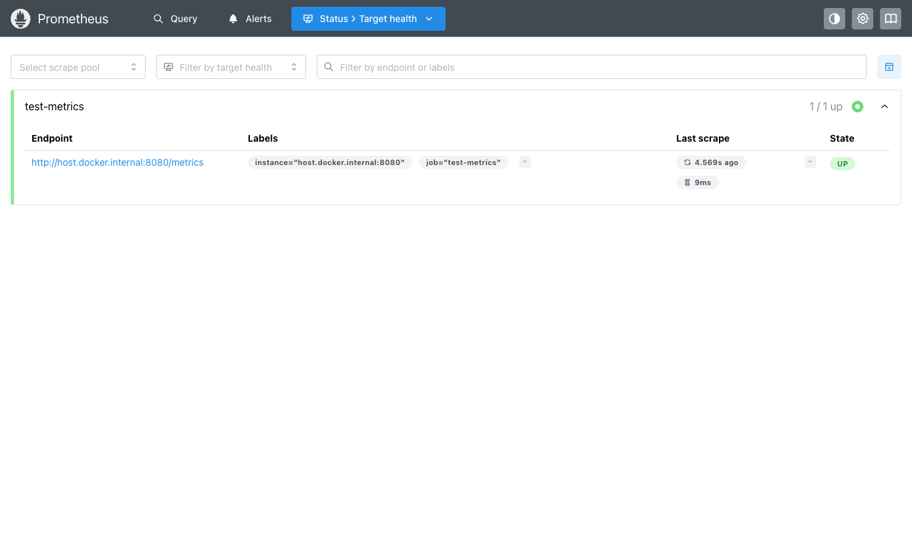
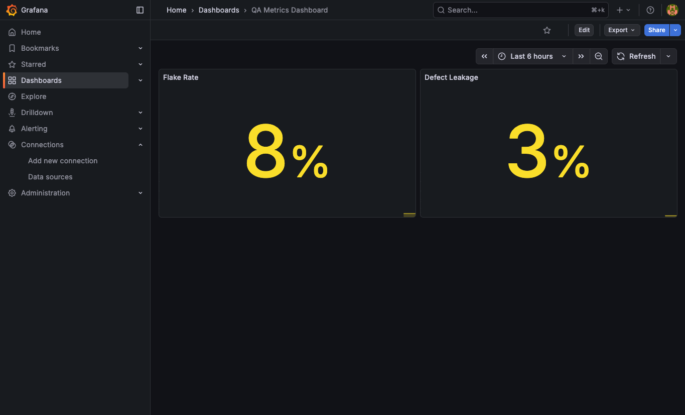

# QA Metrics Observability Stack

Sistema de observabilidad para métricas de calidad de pruebas, desplegado con Docker.

Expone métricas clave como **flake rate** y **defect leakage** en formato Prometheus, las recolecta automáticamente y las visualiza en un dashboard de Grafana.

## Arquitectura

```
┌────────────────┐        ┌────────────┐        ┌────────────┐
│ test-metrics   │ scrape │ Prometheus │  data  │  Grafana   │
│ (Python HTTP)  │◄───────│  :9090     │◄───────│  :3000     │
│ :8080          │ /15s   │            │ source │            │
│                │        │ Almacena   │        │ Dashboard: │
│ flake_rate     │        │ series     │        │ Flake Rate │
│ defect_leakage │        │ temporales │        │ Def Leakage│
└────────────────┘        └────────────┘        └────────────┘
```

## Stack

| Servicio | Imagen | Puerto | Función |
|----------|--------|--------|---------|
| test-metrics | `python:3.11-slim` | 8080 | Exporta métricas en formato Prometheus |
| prometheus | `prom/prometheus` | 9090 | Scraping y almacenamiento de series temporales |
| grafana | `grafana/grafana-oss` | 3000 | Visualización con paneles Stat |

## Quick Start

**1. Levantar el exportador de métricas:**

```bash
docker run -d -p 8080:8080 --name test-metrics python:3.11-slim \
  python3 -c '
from http.server import HTTPServer, BaseHTTPRequestHandler

METRICS = """# HELP flake_rate Percentage of flaky tests
# TYPE flake_rate gauge
flake_rate 0.08
# HELP defect_leakage Defects escaping to production
# TYPE defect_leakage gauge
defect_leakage 0.03
"""

class Handler(BaseHTTPRequestHandler):
    def do_GET(self):
        self.send_response(200)
        self.send_header("Content-Type", "text/plain; charset=utf-8")
        self.end_headers()
        self.wfile.write(METRICS.encode())
    def log_message(self, *a): pass

HTTPServer(("0.0.0.0", 8080), Handler).serve_forever()
'
```

**2. Levantar Prometheus:**

```bash
docker run -d -p 9090:9090 --name prometheus \
  -v $(pwd)/prometheus.yml:/etc/prometheus/prometheus.yml \
  prom/prometheus
```

**3. Levantar Grafana:**

```bash
docker run -d -p 3000:3000 --name grafana \
  -e GF_SECURITY_ADMIN_USER=admin \
  -e GF_SECURITY_ADMIN_PASSWORD=admin \
  grafana/grafana-oss
```

**4. Configurar Grafana:**

- Abrir `http://localhost:3000` (login: `admin` / `admin`)
- Agregar Prometheus como data source: `http://host.docker.internal:9090`
- Crear dashboard con queries `flake_rate` y `defect_leakage`

## Métricas

| Métrica | Tipo | Descripción |
|---------|------|-------------|
| `flake_rate` | gauge | Porcentaje de pruebas inestables |
| `defect_leakage` | gauge | Defectos que escapan a producción |

## Screenshots

### Endpoint de métricas


### Prometheus - Target UP


### Grafana - Dashboard


## Cleanup

```bash
docker stop test-metrics prometheus grafana
docker rm test-metrics prometheus grafana
```

## Tecnologías

- Docker
- Python 3.11
- Prometheus
- Grafana OSS
